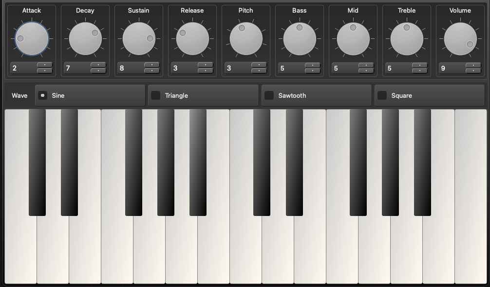

# SnakeSynth
A basic synthesizer application created using Python, using SciPy for wave generation, NumPy for wave manipulation and PySide for GUI.
___

### Project Contributors
1. Nora Luna
2. Rohan Singh
3. Jay Best
4. Tien Duc Pham
___

### Overview
The main objectives of this project are:
- To design and implement a synthesizer using Python.
- To develop an interface for the synthesizer that allows users to interact with it and create sounds.
- To incorporate various waveforms and filters to create a diverse range of sounds.
- To enable the synthesizer to be used as a live performance tool or as a studio production tool

**MVP:** An application that has keys to generate different tones, with volume control.
___
### Prerequisites to set up SnakeSynth

- Python3
- PySide6
- SciPy
- NumPy
- Qt Creator 4.15.0
- VS Code
- VS Code Plugins:
	- Python
	- Pylance
	- Qt for Python
___

### How to Build and Run SnakeSynth

1. Download the files in this repository.
2. Ensure you have Python and pip downloaded on your local machine.
	https://www.python.org/
3. Create a Python environment in the root folder of the downloaded files.
	`python3 -m venv env`
	`source env/bin/activate`
4. Download the requirements. 
	`pip install -r requirements.txt`
5. Run the synth with the command inside of the src folder:
	`python3 main.py`

### Testing

### SnakeSynth UI

### 